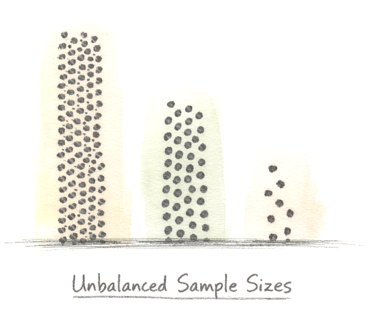

## Ecology is non-normal and structured

So far, in this course, we have focused on non-normal data and how GLMs have been designed to handle counts, proportions, and zero-inflated data. But this inherent non-normality of ecology is only one feature with which we must content. As messy as it seems, ecology is also highly structured:

* **Spatial structure:** Nearby individuals resemble each other
* **Temporal structure:** Month or years share environmental conditions.
* **Relatedness structure:** Family members or congeners resemble each other.

These shared processes can generate correlation among observations. Our sampling design and causal account should guide how we represent that dependence in a statistical model. 

Before fitting a mixed model, start with the scientific question, a DAG, and the sampling design. Identify shared causes of the exposure and outcome as well as reasons observations may be dependent. Then choose a statistical structure and assess its fit.

## Extending to a mixed-effects modeling framework

In this section, we extend the GLM frameworks to mixed-effects models, which allow us to quantify how much variation is associated with structured sources such as:

* Hierarchical data
* Unbalanced designs
* Violations of independence

:::: columns
::: {.column width="70%"}
In the course of our examples, we will show how mixed-effects models can ingest and leverage hierarchical data. In terms of dealing with unbalanced designs, mixed-effects models offer another critical advantage: dealing with unbalanced (or uneven) samples sizes. After all, real datasets often include:

* different numbers of individuals per site  
* different numbers of time points per individual  
* missing observations  

Generalized Linear Mixed Models can accommodate unequal numbers of observations per group. To state it clearly: **_Equal sample sizes are not required._**
Likelihood-based estimation handles unequal replication under the model assumptions. Unequal replication can still affect precision, and sparse groups or informative missingness require particular care. 
:::

::: {.column width="30%"}

:::
::::

The last one -- non-independence-- is perhaps the most serious danger to good inference in ecology. As we mentioned, most ecological data are clustered in space or time, and/or have some biological relationships. Measurements on individuals are repeated. Organisms share environments. You get the picture. If you treat dependent observations as independent, your model may misrepresent the information in the data.

By now, the following should be very clear: 

> Generalized linear mixed models are built for real ecological data.

## Non-independence: the central problem

The independence assumption in most statistical models states that:

> Conditional on the modeled causes and grouping structure, the remaining errors are assumed to be independent when the model specifies independence.

In real ecological systems, however, this is rarely true. Dependence can arise through shared causes, repeated measurements, or direct influence between units. It helps to distinguish two sources of concern: 

* **Dependence anticipated from the design or ecology:** repeated sampling and shared environments may be known before analysis
* **Residual dependence under a fitted model:** patterns remain after accounting for the variables and structure specified in that model

Let us go through these in turn.

### Dependence anticipated before modeling

Some dependence follows from the sampling design or the ecology of the system and can be anticipated before modeling. Examples include:

- blocking effects  
- split-plot designs 
- repeated measures (e.g. multiple samples from one individual at one time or across a time series)
- nested sampling (e.g. multiple individuals within multiple plots within multiple sites)

If you structured your sampling hierarchically (e.g. many plots within each of many sites), you have reason to expect shared influences within groups. Your model should consider that structure. A grouping label such as _block_ or _plot_ may call for a fixed effect, a random effect, or another representation, depending on the question, the DAG, and the design.

Individuals, sites, or time points produce related data (similar behaviors of an individual across contexts, similar site conditions, etc.). Though we may have a technically well-replicated study design, ignoring such ecological realities produces what ecologists call _pseudoreplication_ (coined by [Hurlburt (1984)](./files/Hurlbert_1984.pdf)), or: 

> _"...the use of inferential statistics to test for treatment effects with data from experiments where either treatments are not replicated (though samples may be) or replicates are not statistically independent.”_

Pseudoreplication can lead to a severely over-inflated confidence in one's results. When the independence assumption is not met, your model thinks you have more information in your signal (relative to the noise) than you really do. Thus, apparent precision can be overstated, even when the estimated effect size itself is not inflated. This problem is far from being insignificant or trivial; it directly affects inference.

Of course, not all dependence comes from hierarchical structure (like measurements nested in individuals). Sometimes the fitted model also leaves important structure unexplained. 

### Residual dependence revealed after fitting

A model does not create dependence in the ecological system. Instead, it may leave dependence or other systematic patterns in the residuals. As discussed in previous sections, patterns can remain when:

* there is unanticipated/unrealized spatial autocorrelation  
* there is unanticipated/unrealized temporal autocorrelation  
* nonlinear effects are assumed to be linear (a very common problem)  
* you choose an inappropriate error structure (which can cause poor fit even without dependence among observations)  
* you omit ecologically important covariates  

If the systematic (Signal) component is misspecified, its unexplained patterns can appear in the residuals (Noise). Some patterns indicate dependence among observations; others indicate an incorrect mean or error model. Before adding random effects, revisit your DAG, sampling design, fixed-effects structure, and error distribution.

## Scale as the source of non-independence

As we all know, ecological data are not flat and unidimensional. They are layered across space, stretched across time, and organized across biological/ecological levels. If we ignore that interesting structure, we do not simply violate some formal assumptions. Instead, we actively erase the mechanisms of the data-generating process.

Data multidimensionality is the major insight discussed by Simon Levin (1992) in [*“The Problem of Pattern and Scale in Ecology”*](./files/Levin_1992) in which he argues that ecological --and perhaps all biological-- patterns only make sense relative to the scale at which they are studied. Data-generating processes operating at one scale can generate structure at another. Therefore, if we observe data without acknowledging or respecting the importance of scale, we obscure its signal and inflate its noise. 

Shared structure increases the likelihood of common influence, which can create both similarity and correlation. That correlation should not be considered a nuisance, as it is information about how an ecological system is organized. For example: 

* Observations that are proximate in **space** may share a common climate, soil, disturbance regimes, and/orpredators
* Observations that are close in **time** may share weather, phenology, resource pulses, or predators
* Observations within the same **biological unit** (i.e. they are more closely related) may share morphology, physiology, or behavior

If multiple measurements are made at a site, a species, or within an individual, they may share unmeasured variation. This is the essence of non-independence.

## Detecting non-independence: How?

If your design contains repeated or grouped measurements, you know that observations share a unit or setting; the extent of their dependence is still an empirical and modeling question. If you are unsure whether important structure remains, you can do the following: 

### Before modeling

* Plot response by grouping factor(s)
* For continuous predictors (e.g., time), plot relationship with the response variable within groups

If some individuals or sites consistently exhibit high or low values (generally non-overlapping distributions), **group-level differences may be present.** This visual assessment is useful, but it cannot establish why the groups differ. Distinct vertical bands may motivate a group intercept; visibly different slopes may motivate group-specific slopes. Check those choices against the study design and causal question.

### After modeling (tools like the `DHARMa` package)

* Examine residual plots (including quantile-quantile plots)  
* Test for spatial or temporal autocorrelation

As you know by now, examination of these residual patterns can reveal hidden structure of your model. If residuals remain correlated within groups, the fitted model has not accounted for that dependence. Residuals should show no systematic patterns relevant to the question; a clean residual plot does not establish causal identification.

So, what are the components of a mixed-effects model?

## Components of a mixed-effects model

You now know that a Generalized Linear Model (GLM) contains only fixed effects. A mixed-effects model, on the other hand, contains both _fixed_ and _random_ effects. That is the entire difference. Let us clearly differentiate between these two types of effects:

::: {.callout-warning icon=false collapse=true}
## **Fixed effects**
Fixed effects are model terms whose coefficients are estimated directly. They can include focal predictors and variables required for valid adjustment, even if those variables are not of substantive interest. These can be factors whose levels are experimentally determined or whose interest lies in the specific effects of each level, such as effects of covariates, differences among treatments and interactions. Specifically, you are focusing on:

* effect sizes (e.g. slope, odds-ratio, etc.)
* direct interpretation (in relation to the response variable)

**Example:** Consider an experiment examining temperature-dependent differences in jumping height male and female jackalopes. For the response variable (`jumping height`), the two fixed effects are:

* temperature
* sex  

These are the focal variables for this particular biological question. _Does temperature alone increase jumping height? Does sex alone influence jumping heights? Do temperature and sex interact to influence jumping height?_
:::

::: {.callout-warning icon=false collapse=true}
## **Random effects**

Whereas a fixed site term estimates a coefficient for each site (relative to a reference), a random site term models the distribution of site-specific deviations and their variance. This statistical choice does not, by itself, resolve confounding by site-level causes. Examples of random effects include:

* site  
* year  
* individual
* genotype

When their assumptions fit the design, random effects can represent shared variation among observations. Depending on the setting, they may help with:

* Accounting for within-group dependence in uncertainty estimates  
* Avoiding false precision from repeated measurements
* Pooling information across groups
* Describing variation among groups; generalization beyond sampled groups requires additional assumptions

**Why is it called "random effect"?** “Random” refers to a modeled distribution of group-specific deviations. It does not mean that groups were sampled randomly; how groups were selected still matters for generalization. 

:::

---

## Examples of fixed and random effects

Here are two examples of fixed and random-effects structure in different datasets (click to expand):

::: {.callout-note collapse=true icon=false}
## **Example 1: Impact of temperature on vegetation growth in Wyoming Jackalope habitat**

**Study system:** You are studying the effect of temperature on vegetation growth in the area where you study jackalopes. You collect data for many years. You are primarily interesting in making inference about the general effects of temperature. You are not interested in estimating the effect of each specific year. The variable `year` may represent shared unmeasured variation in rainfall, herbivory, and other sources of disturbance. These elements may differ from year to year and inject variability into the data. If there is a directional time trend or year is related to the exposure, a random year intercept alone may be insufficient.

**Fixed effect:** `temperature`

**Random effect:** `year` 

:::

::: {.callout-note collapse=true icon=false}
## **Example 2: Nestling feeding rates in arctic jackalopes**

**Study system:** Your primary question is whether variation in parental feeding rate is associated with nestling age and parental sex. You measure feeding rates at 20 nests. Each nest contains multiple nestlings, and you track the identity and age of each nestling. You also record feeding behavior of both parents. 

**Fixed effect:** `nestling_age` and `parental_sex`. 

**Random effect:** `nestling_id` nested within `nest`, which is further nested within `mother-father pair`. To account for this structure, you include nest as a random effect and nestling nested within nest as a random effect. Observations from the same nest are more similar to one another than to observations from different nests. Likewise, repeated observations of the same nestling are not independent.

:::

---

## Bibliography for this section

_Cited:_
Hurlbert, S. H. (1984). Pseudoreplication and the design of ecological field experiments. _Ecological Monographs_, 54(2), 187–211.

_Other useful references:_

Austin, P. C., & Leckie, G. (2018). The effect of number of clusters and cluster size on statistical power and Type I error rates when testing random effects variance components in multilevel linear and logistic regression models. _Journal of Statistical Computation and Simulation_, 88(16), 3151–3163. https://doi.org/10.1080/00949655.2018.1504945

Clarke, P. (2008). When can group level clustering be ignored? Multilevel models versus single-level models with sparse data. _Journal of Epidemiology & Community Health_, 62(8), 752–758. https://doi.org/10.1136/jech.2007.060798

Gelman, A., & Hill, J. (2007). _Data analysis using regression and multilevel/hierarchical models._ Cambridge University Press.