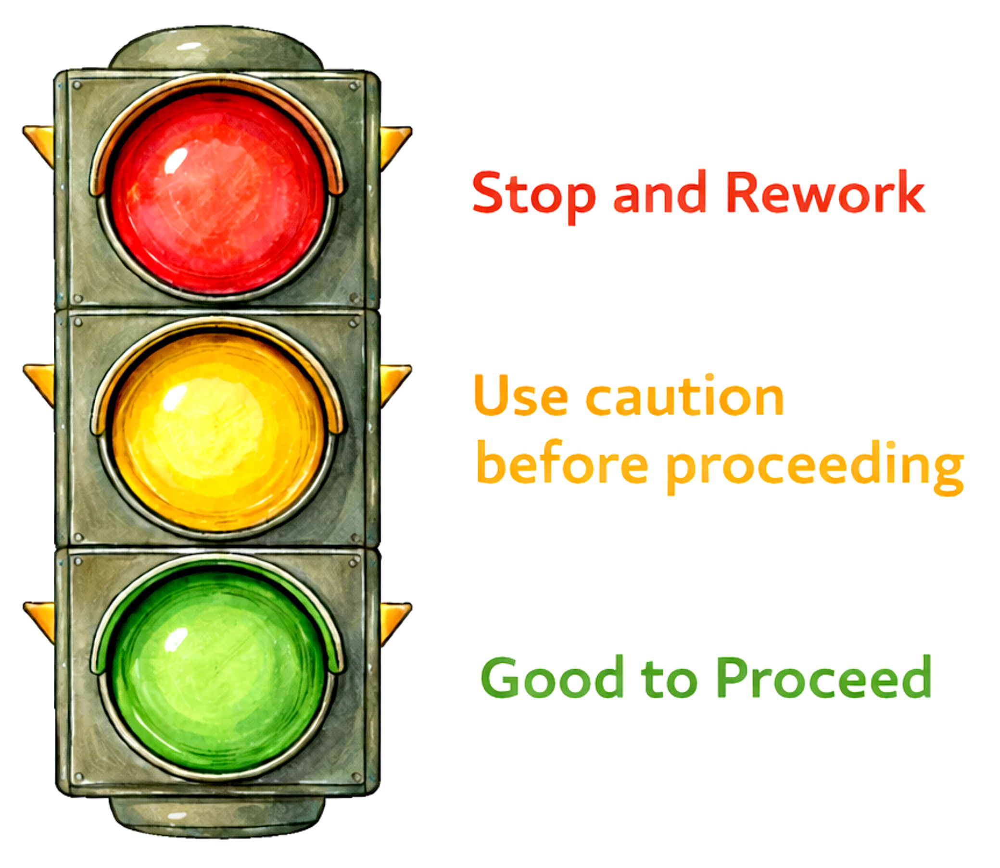

This page describes the Milestone Assignments referenced in the course calendar. These should not be viewed as eight separate assignments. Each milestone builds on the previous one, moving from a clearly defined scientific target through causal identification, estimation, inference, and final synthesis. Each section below explains the purpose of the milestone, what to submit, and what a “good” assignment typically looks like. The general rubric is described at the end of this page.

## Milestone Assignment descriptions

::: {.callout-note title="**Scientific Question + Estimand Note (Week 2; due 11-Sep)**" icon="false" collapse="true"}
**Purpose:**\
Define the scientific target before you choose a DAG, statistical model, or model family. This assignment is about making clear what you are actually trying to learn from your project.

### What to include

-   **Broad scientific context**
    -   Briefly identify the larger proposition or *hyperthesis* your project addresses
-   **Specific hypothesis**
    -   State the hypothesis you intend to evaluate
    -   Keep it focused enough that it can generate a specific prediction
-   **Prediction(s)**
    -   State the expected pattern or contrast in a form that connects directly to your focal effect
-   **Primary estimand**
    -   Describe the effect you want to estimate
    -   Identify the exposure/treatment, outcome, and relevant comparison
    -   State the population, units, or conditions to which the effect applies when relevant
-   **Brief project and data description**
    -   Study system
    -   Unit of analysis
    -   Data source and basic sampling structure

### Submission format

-   Approximately 1–2 pages (Word) or a short Quarto page
-   Use clear headings so the progression from scientific idea → hypothesis → prediction → estimand is easy for me to follow
-   Include the final Evaluation Table (i.e. rubric-tested) output from JackalopeGPT with your submission

### “Good” looks like

-   A hypothesis and prediction that clearly follow from the broader scientific idea
-   An estimand that says exactly what effect you want to learn about
-   A scientific target that is plausible (given the  data and scope of a one-semester project)
-   No commitment to a statistical model simply because it is familiar
:::

::: {.callout-note title="**Causal Analysis Plan (Week 4; due 25-Sep)**" icon="false" collapse="true"}
**Purpose:**\
Show that your scientific question, causal assumptions, estimand, and identification strategy fit together *before* you begin serious statistical modeling. This is the major causal-planning milestone for the project.

### What to include

-   **Your current DAG**
    -   Include the variables and causal relationships needed to represent the system relevant to your focal estimand
    -   Keep the graph focused: not every ecological process in the ecological universe belongs in your DAG
-   **Causal assumptions**
    -   Briefly explain the most important arrows
    -   Identify important assumptions represented by missing arrows when necessary
-   **Primary estimand**
    -   Restate or refine the estimand from your Week 2 note
-   **Causal roles**
    -   Identify important exposures, outcomes, confounders, mediators, colliders, or other variables relevant to the focal effect
-   **Identification argument**
    -   Explain why the focal effect is identifiable—or why it may not be
    -   Identify the adjustment strategy implied by the DAG
    -   Explain why key variables should or should not be conditioned on
-   **Major unmeasured threats**
    -   Identify the most important unmeasured variables or assumptions that could threaten the causal interpretation

### Submission format

-   Word or Quarto page
-   Include a legible DAG plus concise text explaining the reasoning behind it
-   The goal is not a giant causal encyclopedia; emphasize assumptions that matter for your focal estimand
-   Include the final Evaluation Table (i.e. rubric-tested) output from JackalopeGPT

### “Good” looks like

-   The DAG, estimand, and identification argument tell the same causal story
-   Adjustment decisions follow from causal reasoning rather than variable screening or AIC
-   Important assumptions and unmeasured threats are visible rather than hidden
-   You can explain why the proposed analysis would estimate the effect you claim it estimates
:::

::: {.callout-note title="**Data + Estimator Plan (Week 6; due 09-Oct)**" icon="false" collapse="true"}
**Purpose:**\
Connect the causal architecture of your project to the data you actually have and to the statistical machinery you will use. This milestone asks whether your measured variables can represent the DAG well enough to estimate the focal effect.

### What to include

**Part 1: From DAG nodes to measurements**

-   Map the important variables in your DAG to variables in your dataset
-   For each major measured variable, document as needed:
    -   what was measured
    -   units or coding
    -   sampling or grouping structure
    -   important measurement limitations
-   Identify important DAG variables that are missing or only imperfectly measured

**Part 2: Data quality + targeted EDA**

-   Summarize missingness, exclusions, and obvious data-quality problems
-   Include a *small* set of useful exploratory plots or tables
    -   Focus on features that affect the proposed estimator: distributions, sparsity, clustering, nonlinear patterns, temporal structure, etc.
    -   Do not submit a plot dump
-   Explain what the EDA changes (or does *not* change) about your analysis plan

**Part 3: Proposed estimator**

-   Name the statistical estimator/model you currently plan to use
    -   e.g., GLM, GLMM, GAM, GAMM, standardization/g-computation, or another appropriate approach
-   Give the proposed model structure or formula when possible
-   Explain why the estimator is appropriate for:
    -   the estimand
    -   the outcome distribution
    -   the sampling/dependence structure
    -   the functional relationships you expect
-   Briefly describe how your files/code are organized so the analysis can be reproduced (this is primarily for your own records)

### Submission format

-   Word or Quarto page; a concise metadata/data dictionary may be included as a table or separate file
-   Include only EDA that informs measurement, model structure, or estimation
-   Include the final Evaluation Table (i.e. rubric-tested) output from JackalopeGPT

### “Good” looks like

-   A clear mapping from causal variables → measured variables → statistical estimator
-   Honest treatment of measurement limitations and missing information
-   EDA used purposefully rather than as a search for “significant” patterns
-   An estimator justified by the scientific target and data structure (not merely by software availability or familiarity)
:::

::: {.callout-note title="**Working Estimator Checkpoint (Week 8; due 23-Oct)**" icon="false" collapse="true"}
**Purpose:**\
Run a real model (estimator) early enough to catch any obvious implementation problems. This is a checkpoint; this is *not* a rigid model that you must marry. You are, of course, allowed to make careful changes that are consistent with the *a priori* established causal reasoning, data structure, or model diagnostics.

### What to include

-   **Current primary estimator/model**
    -   Model formula or equivalent specification
    -   Family/link, random effects, smooths, correlation structures, or other important components where relevant
-   **Why this estimator**
    -   Briefly connect the specification back to your estimand and identification strategy
-   **Key diagnostics/checks**
    -   Include a small number of checks that tell you whether the estimator is behaving reasonably
    -   Flag obvious violations, convergence problems, residual structure, poor support, or other concerns
-   **Preliminary estimate**
    -   Include a preliminary focal effect estimate if the analysis is ready for one
    -   If it is not ready, say exactly what is intefering with the estimation
-   **Unresolved issues**
    -   What remains uncertain, broken, or incomplete?
    -   What changes are you considering, and what would justify them?

### Submission format

-   RProj folder complete with Quarto (preferred) as well as raw data file with enough code/output description to make the estimator reproducible
-   Keep diagnostics selective and interpretable
-   Include the final Evaluation Table (i.e. rubric-tested) output from JackalopeGPT

### “Good” looks like

-   A runnable estimator that follows from the causal and data plans
-   Diagnostics are used to learn about problems rather than simply certify the model
-   Any proposed changes have a scientific or statistical justification
-   Known problems are stated plainly rather than hidden
:::

::: {.callout-note title="**Estimate + Inference Checkpoint (Week 11; due 13-Nov)**" icon="false" collapse="true"}
**Purpose:**\
Align the estimand, numerical estimate, uncertainty, and scientific claim. This is where you demonstrate that the quantity produced by your analysis actually supports the statement you set out to make.

### What to include

-   **Primary estimate(s)**
    -   Report the focal effect on a scientifically interpretable scale (no weird ratios that take 10 minutes to decipher)
    -   Use contrasts, standardized/g-computed estimates, predictions, or other summaries appropriate to your estimand
-   **Uncertainty**
    -   Provide confidence intervals, credible intervals, simulation-based uncertainty, or another appropriate summary
    -   Explain what the uncertainty represents
-   **Diagnostics and sensitivity**
    -   Include the checks most relevant to trusting the estimate
    -   Add a lightweight sensitivity/robustness check where useful
-   **Exact supported claim**
    -   Write the scientific claim that you think follows from the estimate
    -   Make the population, comparison, direction, magnitude, or conditions explicit when appropriate
-   **Assumptions and limitations**
    -   Identify the assumptions most important to the causal interpretation
    -   Explain the major remaining limitations
-   **What cannot be inferred**
    -   State at least one tempting interpretation that the analysis does *not* support

### Submission format

-   Approximately 1–2 pages plus the minimum figures/tables needed to show the estimate and uncertainty
-   Word or Quarto
-   Include the final Evaluation Table (i.e. rubric-tested) output from JackalopeGPT

### “Good” looks like

-   The reported estimate corresponds to the stated estimand
-   Uncertainty is visible and interpreted rather than treated as decoration
-   The scientific claim does not outrun the identification assumptions or data
-   You can distinguish what the analysis supports from what remains unknown
:::

::: {.callout-note title="**Interpretation / Peer-Audit Memo (Week 12; due 20-Nov)**" icon="false" collapse="true"}
**Purpose:**\
Turn peer critique into concrete revision. Rather than producing another long interpretation assignment, this short memo asks you to identify the most important problems revealed by the audit and explain what you will do about each of them.

### What to include

Respond to **three issues** identified through peer review:

-   **One causal issue**
    -   e.g., DAG structure, identification, adjustment, causal language, or an important assumption
-   **One statistical issue**
    -   e.g., model specification, diagnostics, uncertainty, functional form, dependence, or estimation
-   **One communication issue**
    -   e.g., figure/table clarity, terminology, organization, or a claim that is difficult to interpret

For each issue:

-   Briefly describe the concern
-   State whether you agree that it requires revision
-   Explain the change you will make—or justify why you will not make one
-   Note any consequence for the estimand, estimator, estimate, or inference

### Submission format

-   Short memo (Word format is fine); approximately 1 page is usually enough
-   A simple three-part structure is encouraged: **causal → statistical → communication**
-   Include the final Evaluation Table (i.e. rubric-tested) output from JackalopeGPT

### “Good” looks like

-   Peer feedback is evaluated thoughtfully; do not simply accept all revisions.
-   Planned revisions are very specific and actionable
-   You recognize when one change propagates through other parts of the causal workflow
-   The memo makes the next stage of revision obvious
:::

::: {.callout-note title="**Integrated Analysis Draft (Week 14; due 04-Dec)**" icon="false" collapse="true"}
**Purpose:**\
Assemble the major pieces of the project into one coherent analytical narrative. (This should be easy.) This is the concrete object used for your final report: it should be complete but still considered a draft.

### What to include

Your draft should make the following chain easy to follow:

-   **Scientific question and hypothesis**
    -   Briefly establish the broader proposition/hyperthesis and focal hypothesis(es)
-   **Prediction and estimand**
    -   State the focal prediction and exactly what effect you set out to estimate
-   **DAG and causal assumptions**
    -   Include the current causal diagram and the assumptions most important to the analysis
-   **Identification**
    -   Explain the adjustment/identification strategy
-   **Data and estimator**
    -   Connect measured variables and sampling structure to the estimator
    -   Describe the final or near-final statistical specification
-   **Estimate and uncertainty**
    -   Present the focal effect estimate(s), uncertainty, and key diagnostics
-   **Inference**
    -   State the scientific interpretation supported by the analysis
    -   Identify major limitations and what cannot be concluded
-   **Figures and tables**
    -   Include the key visual or tabular results needed to understand the analysis

### Submission format

-   Word or Quarto render (HTML preferred)
-   This does *not* have to look like a conventional journal manuscript; organization around the causal workflow is encouraged
-   Figures and tables should be legible, captioned, and referenced in the text
-   Include the final Evaluation Table (i.e. rubric-tested) output from JackalopeGPT

### “Good” looks like

-   A reader can trace the logic from scientific question to inference without reconstructing it from scattered pieces
-   Terminology and target effects remain consistent throughout
-   Figures and tables support the main argument rather than simply display output
-   Remaining weaknesses are limited enough that focused revision can produce the final report
:::

::: {.callout-note title="**Final Report (Week 15; due 11-Dec)**" icon="false" collapse="true"}
**Purpose:**\
Demonstrate the complete estimand-aware workflow developed throughout the course. The goal is not to produce a giant everything-you-have-ever-done document or to force every project into a conventional manuscript structure. The goal is a coherent, defensible analysis in which the scientific question, causal assumptions, statistical estimation, and inference all line up.

### What to include

Your final report should integrate:

-   **Proposition/hyperthesis, hypothesis, and prediction**
    -   Establish the scientific logic leading to the analysis
-   **Primary estimand**
    -   State clearly what causal or statistical effect you sought to estimate
-   **DAG and causal assumptions**
    -   Present the causal structure relevant to the focal estimand
    -   Explain the assumptions that matter most
-   **Identification**
    -   Explain why the focal effect is—or is not—identifiable under those assumptions
    -   State the adjustment strategy or other identification logic
-   **Data and measurement**
    -   Describe the data, sampling structure, and important measurement limitations
-   **Estimator**
    -   Explain the statistical machinery used to estimate the target effect
    -   Include important diagnostics and justification
-   **Estimate and uncertainty**
    -   Present the focal estimate(s) on an interpretable scale
    -   Make uncertainty explicit
-   **Inference and limitations**
    -   State the scientific conclusion supported by the analysis
    -   Distinguish that conclusion from claims the analysis cannot support
    -   Identify the assumptions or limitations that matter most
-   **Key figures and tables**
    -   Include only those that materially help communicate the analysis

### Submission format

-   Quarto render (HTML or PDF preferred)
-   Organize the report so the causal and inferential logic is easy to follow
-   Keep the report focused on the *final* analytical story rather than documenting every abandoned model or exploratory detour

**Instructions:** [**Click here for the complete (and exhaustive) set of instructions.**](https://jpkelley.github.io/ZOO5500/chapters/final_report_overview.html)

### “Good” looks like

-   The scientific question, estimand, DAG, identification strategy, estimator, estimate, and inference form one coherent chain
-   Causal claims are proportional to the assumptions and evidence supporting them
-   Uncertainty and important limitations are visible
-   A skeptical reader can understand both what you learned and why you believe the analysis supports it

### Important note about grades on the Final Report. 

Because the component parts of the Final Report have been graded throughout the term, I will not be re-reading all Final Report Submissions. There is simply not enough time to give a full review of all submissions. That said, I will be skimming each submission and spot-checking specific points about which I made notes during the course of the term. 

:::

------------------------------------------------------------------------

## General assignment submission requirements

You may choose to submit a raw Quarto Markdown file or submit a version of it rendered as a Word document (so that it is editable by me). As long as it is legible and, more importantly, makes sense within your own workflow, it works for me.

Here is a brief note about Quarto Markdown, which is preferred to R Markdown. While R Markdown is **not** obsolete by any means, it has a number of disadvantages compared to Quarto; these are summarized in the table below.

| Dimension         | R Markdown  | Quarto                     |
| ----------------- | ----------- | -------------------------- |
| age               | older       | newer                      |
| primary language  | R           | multi-language             |
| document types    | reports     | docs, books, sites, slides |
| cross-referencing | manual      | built-in                   |
| extensibility     | constrained | modular                    |

So, in your own work, if you ever anticipate wanting to streamline your workflow, I recommend migrating your old R Markdown files to Quarto. Note that there are a few steps to do so, steps that involve changing file headers and syntax. I have had to do this with my older R Markdown files, and it doesn't take much time. Quarto can really add huge advantages, including reproducible creation of scientific presentations (sometimes in minutes and not hours). 

For this course, please use Quarto.

## Grading

::::: columns
::: {.column width="70%"}
Numerical grades are downright loathsome. And boring. And laborious. For all assignments, I use the Traffic Signal Grading Scale:

| Grade  | Simple meaning   | Scientific judgement                       |
|--------|------------------|--------------------------------------------|
| Green  | Good to Proceed  | Scientifically coherent for this milestone |
| Yellow | Exercise Caution | Viable, but revision is required           |
| Red    | Stop and Rework  | Not yet ready for scientific judgment      |

Yellow is **not** bad. It just means there are certain elements that you should tighten up before moving on.
Red is also **not** bad. It just means there are *more* elements that you should tighten up before moving on.
Hmm...see a pattern here? Maybe top-tier science is built upon iterative improvements?
:::

::: {.column width="30%"}

:::
:::::

## Universal Milestone Grading Rubric

*The Traffic Signal Grading Scale applies to all Milestone Assignments. Grading reflects scientific readiness relative to the purpose of the milestone.*

| Dimension | 🟢 GREEN: Good to Proceed | 🟡 YELLOW: Exercise Caution | 🔴 RED: Stop and Rework |
|------------------|------------------|------------------|------------------|
| **Purpose & intent** | Clearly meets the core intent of the milestone | Partially meets intent; key elements need revision | Does not meet the core intent of the milestone |
| **Question or objective** | Clear, focused, and appropriate for this stage | Present but vague, drifting, or overly broad | Unclear, unfocused, or missing |
| **Alignment (question–data–methods)** | Question, data, and approach are coherently aligned | Partial alignment; gaps or weak links remain | Fundamental mismatch between components |
| **Reasoning & assumptions** | Reasoning is coherent; assumptions or limitations acknowledged | Reasoning incomplete or assumptions implicit | Reasoning unclear or unsupported |
| **Claims & language** | Claims are appropriate for the stage of analysis | Some overreach or ambiguous language | Claims exceed what the work can support |
| **Course GPT self-check** | Used appropriately; issues addressed or justified | Used, but issues only partially addressed | Little or no meaningful evidence of self-checking |
| **Scientific readiness** | Work is ready to move to the next stage | Viable but requires targeted revision | Not yet in a usable scientific state |

This universal grading scale is meant to help you quickly understand where your work stands, not to highlight small mistakes. My goal here is to make expectations clear, keep grading transparent, and help you focus on doing solid, defensible science --all without unnecessary stress over points or formatting (which we will let GenAI work on for you). The scale's primary benefits include:

-   **It is easy to read.** The traffic light color scheme (green, yellow, and red) tell you right away whether your work is ready to move forward, needs some fixing, or needs a more substantial rethink (the majority of good scientists' ideas)
-   **It is the same for every assignment.** I use this scale for all milestone assignments. Therefore, the standards are predictable for every assignment.
-   **It centers on scientific readiness, not scientific perfection** (which, technically, does not exist). You are not being graded on having the “right” answer. What matters most to me is whether your question, data, and reasoning co-exist coherently together.
-   **It matches how real science works.** Research almost never gets it right on the first try; drafts, checks, and revisions are normal.
-   **It allows for rapid feedback.** GenAI will do some of the busy work associated with troubleshooting coding issues or improving clarity, which will give me more time to gauge the scientific readiness of your work. A win-win for us all!
