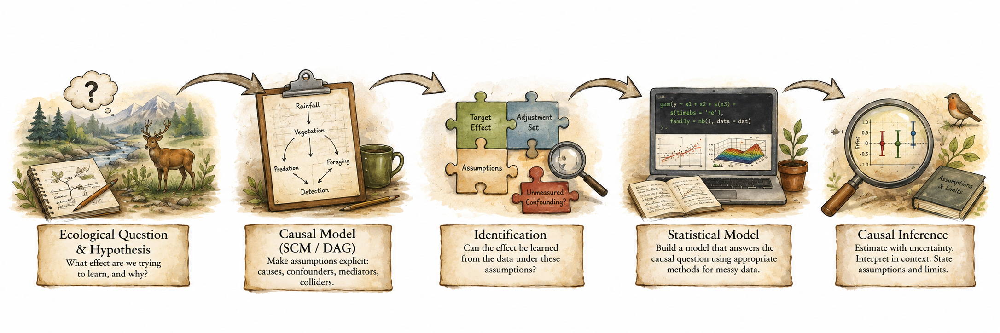

## Welcome to Quantitative Analysis of (Messy) Field Data!

Thanks for being the new cohort of Jackanapes this term! I could not be more pleased by the "large" size of the class. More people means more perspectives as we learn to reason our way from ecological questions to defensible inference.

As ecologists, we rarely just want to describe nature. Just look at most published ecology papers! From the verbiage used by most ecologists (especially non-experimental ones), it is clear that the ultimate goal is to understand *why nature works the way it does*. Understanding *why* something happens requires more than fitting statistical models. We ecologists need to be explicit about what effect we want to learn, what we think causes what, and whether our data can actually identify that effect. On all three, we ecologists need to make drastic improvements. This is one focus of my lab, and this is the reason why I teach this course. We will begin with ecological hypotheses and estimand-aware predictions, use Structural Causal Models (SCMs) and DAGs to make our causal assumptions explicit, and only then turn to the statistical models that are most familiar in traditional ecological analyses. Along the way, we will see that many common approaches actually alter our original questions, sometimes without our knowledge. 

The course path looks something like this:

Along the way, we will question some familiar practices: how AIC cannot tell us which variables should be controlled, how coefficients in a multiple regression model are usually not comparable effect sizes, how traditional covariance-based Structural Causal Models upset natural causal structure of systems, and adding more (or removing) covariates without knowing their function in the data-generating system can sometimes increase rather than reduce bias.

Of course, moving from an ecological idea to a scientifically defensible inference can be extremely daunting, especially when you have  messy field data, imprecise measurements, uneven sampling, nonlinear relationships, and looming deadlines. A central goal of this course is to help you  become more comfortable with this entire process while also learning from one another. Each of us (including me) approaches problems differently, and those differences allow us to make faster and more meaningful headway towards making sense of a very complex world.

## Course Objectives

By the end of this course, you should be able to:

- **Convert ecological ideas into testable questions.** Construct hypotheses logically and develop predictions that specify the effect (estimand) you actually want to estimate.
- **Represent causal assumptions explicitly.** Use SCMs and DAGs to describe how you think an ecological system works and distinguish among confounders, mediators, colliders, and other variables.
- **Determine whether an effect is identifiable.** Ask whether the causal effect you care about can actually be estimated from the data you have (and under what assumptions).
- **Build statistical models that match the question.** Use GLMs, GLMMs, GAMs, GAMMs, and related approaches after determining the causal question and appropriate adjustment set (which also reduce minimal required sample sizes).
- **Recognize when common analytical approaches cause trouble.** Understand why AIC-based variable selection, “controlling for everything,” and traditional, covariance-based Structural Equation Models (SEMs) can create biased results and do not alone tell us which causal effects we are estimating.
- **Deal with messy ecological data.** Account for repeated observations, hierarchical structure, nonlinear relationships, imperfect detection, measurement error, and other complications of real field data.
- **Interpret effects rather than just model output.** Explain what was estimated, the assumptions required, the uncertainty involved, and what the result actually means biologically.
- **Develop transparent and reproducible analyses.** Make the reasoning that connects hypotheses, causal assumptions, statistical models, and biological conclusions explicit so that models are either well-supported or fail loudly.

## Topics covered {.unnumbered}

The course covers the following topics, roughly in the following order:

- **Hypotheses and predictions:** logical formulation and estimand-aware predictions
- **Structural Causal Models and DAGs:** causal assumptions and pathways
- **Causal identification:** confounding, adjustment, and identifiable effects
- **Metrology:** measurands, measurement error, uncertainty, and data quality
- **Exploratory data analysis:** purposeful exploration of messy data
- **Generalized Linear Models (GLMs):** linear relationships and estimation of focal effects
- **Hierarchical data and GLMMs:** dependence, random effects, and effective sample size
- **GAMs and GAMMs:** nonlinear ecological relationships
- **Spatial and temporal structure:** heterogeneity and dependence
- **Model evaluation:** diagnostics, validation, prediction, and appropriate use of AIC
- **Inference:** effect sizes, uncertainty, and interpretation
- **Communication:** figures, tables, and defensible Results sections

Given this ambitious scope (and depending on the course pacing), we may only scratch the surface of some topics. Even our cursory treatment is aimed at convincing you why these subjects matter for scientists who have messy data.

## What is new this term (Fall 2026)?

This course generally contains the same material as in Spring 2026 when the new "causal" version of this course was inaugurated. Of particular importance to you are the following course components:

-   **Using large-language models (LLMs) --via ChatGPT-- to improve analytical workflows.** This term, I have changed the way that ChatGPT is integrated into the course. as a way to support the *process* of analysis rather than to automate the analysis itself. Many of the hardest parts of quantitative work happen outside of writing code: figuring out why R code isn’t behaving as expected, checking whether an interpretation actually follows from a model, troubleshooting an obscure error message, or getting feedback on how tp clearly document a decision. Used carefully, ChatGPT can act like a sounding board for troubleshooting, sanity-checking, and refining explanations without taking over your critical thinking. Throughout the course, I have deliberately constrained ChatGPT's role and scope and have tailored its guardrails to match the course progression. In other words, ChatGPT is used to help improve analytical workflow and decision-making, not to generate results or write code on a student’s behalf. We will work together to assess the utility of this tool as the term advances.

::::: columns
::: {.column width="80%"}
-   **Using large-language models (LLMs) to streamline learning and teaching at scale.** What does this mean? Very simply, it means that I customize an AI agent to do some of the busy work for me (e.g. checking code consistency, making sure there all assignment components are present, etc.). Therefore, I have worked hard to leverage my freelance work as an LLM-consultant and tester for two AI companies to carefully explicitly integrate chatGPT's LLMs into my teaching/grading workflow. This means that you will use a custom GPT that I created specifically for ZOO/ECOL-5500 called [JackalopeGPT](https://chatgpt.com/g/g-696966777a948191858541cd7986057e-jackalopegpt){target="_blank"} (using ChatGPT) to run checks on your work prior to submission; this will solve some of the "tuning" issues (with codes, grammar, clarity, etc.) that I have seen in student submissions in previous years and allow me to focus on more substantial feedback.
:::

::: {.column width="20%"}

:::
:::::

-   **Jackalopes!** This course continues its work to correct a long-standing perspective that (1) jackalopes had deer-like antlers (Fig. 1), and (2) there was only a single species of jackalopes (Fig. 2). We will use many jackalope species in the newly discovered cryptid ecosystem for course exercises and examples.

